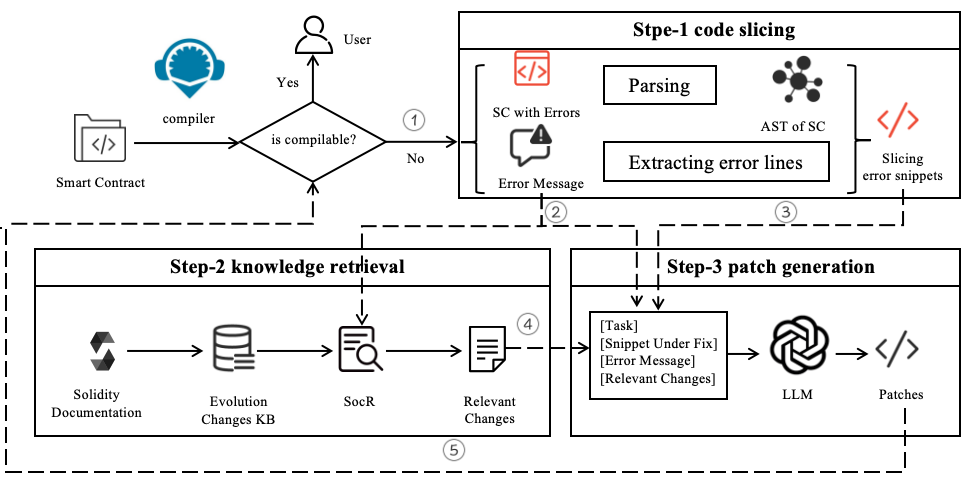

# SMCFixer
## Introduction
Solidity, the dominant smart contract language for
Ethereum, has rapidly evolved with frequent version updates
to enhance security, functionality, and developer experience.
However, these continual changes introduce significant chal-
lenges, particularly in compilation errors, code migration, and
maintenance, making it increasingly difficult for developers to
adapt. Our study systematically investigates these challenges by
analyzing the impact of Solidity version evolution, revealing that
81.69% of examined contracts encounter errors when compiled
across different versions, with 86.92% of compilation errors.

To address these issues, we evaluated the effectiveness of large
language models (LLMs) in resolving Solidity compilation errors
caused by version migrations. Through extensive experiments
on open-source LLMs (GPT-4o, GPT-3.5-turbo) and closed-
source (LLaMa3, DeepSeek) LLMs, we find that while LLMs
demonstrate potential to fix errors, their performance varies
significantly depending on the type of error and prompt granu-
larity. Our findings highlight the importance of domain-specific
knowledge in improving LLM-driven solutions for Solidity repair.

Based on these insights, we propose SMCFIXER, a novel
framework that integrates expert knowledge retrieval and LLM-
based repair mechanisms to enhance Solidity compilation error
resolution. SMCFIXER consists of three core components: code
slicing, knowledge retrieval, and patch generation, designed to
extract relevant error information, retrieve expert knowledge
from official documentation, and iteratively generate patches for
Solidity migration. Experimental results show that our approach
significantly improves repair accuracy across various Solidity
versions, achieving a 24.24% improvement over standalone GPT-
4o on real-world datasets, with a peak accuracy of 96.97%

## Overall Framework
SMCFIXER comprising three key modules: code slicing, knowledge retrieval, and patch generation. Given a Solidity code file, we first use Remix [18] to attempt compilation. If the file fails to compile, our approach automatically generates patches by leveraging the compiler’s error messages and relevant expert knowledge. 

## Usage
First download the relevant dependencies
‘pip install -r requirements.txt’
