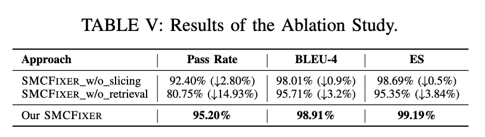

# SMCFixer
## Introduction
Solidity, the dominant smart contract language for
Ethereum, has rapidly evolved with frequent version updates
to enhance security, functionality, and developer experience.
However, these continual changes introduce significant chal-
lenges, particularly in compilation errors, code migration, and
maintenance, making it increasingly difficult for developers to
adapt. Our study systematically investigates these challenges by
analyzing the impact of Solidity version evolution, revealing that
81.69% of examined contracts encounter errors when compiled
across different versions, with 86.92% of compilation errors.

To address these issues, we evaluated the effectiveness of large
language models (LLMs) in resolving Solidity compilation errors
caused by version migrations. Through extensive experiments
on open-source LLMs (GPT-4o, GPT-3.5-turbo) and closed-
source (LLaMa3, DeepSeek) LLMs, we find that while LLMs
demonstrate potential to fix errors, their performance varies
significantly depending on the type of error and prompt granu-
larity. Our findings highlight the importance of domain-specific
knowledge in improving LLM-driven solutions for Solidity repair.

Based on these insights, we propose SMCFIXER, a novel
framework that integrates expert knowledge retrieval and LLM-
based repair mechanisms to enhance Solidity compilation error
resolution. SMCFIXER consists of three core components: code
slicing, knowledge retrieval, and patch generation, designed to
extract relevant error information, retrieve expert knowledge
from official documentation, and iteratively generate patches for
Solidity migration. Experimental results show that our approach
significantly improves repair accuracy across various Solidity
versions, achieving a 24.24% improvement over standalone GPT-
4o on real-world datasets, with a peak accuracy of 96.97%

## Overall Framework
SMCFIXER comprising three key modules: code slicing, knowledge retrieval, and patch generation. Given a Solidity code file, we first use Remix [18] to attempt compilation. If the file fails to compile, our approach automatically generates patches by leveraging the compiler’s error messages and relevant expert knowledge. 

## Evaluation
### RQ1: What is the current state of Solidity version evolution, and what challenges does it pose? 
Solidity’s rapid evolution (84 versions,
131 major changes) poses challenges during smart contract
migration. Version gaps often trigger compilation errors
(71% of changes introduce such issues), underscoring
developers’ struggles to keep pace with language updates.

### RQ2: Can LLMs help solve the challenges brought by the Solidity version evolutions mentioned above? 
LLMs exhibit varying capabilities in resolving Solidity compilation errors, with performance differing significantly across error types. Increasing prompt
granularity directly enhances their effectiveness in addressing these issues.

### RQ3: How does our approach perform in fixing errors?
We compare our approach with open-source and closed-source LLMs to verify the overall performance of SMCFIXER fixing compile errors.
Our method boosts LLMs' ability to fix Solidity errors from version updates, surpassing standalone models and reducing performance disparities between smaller and larger LLMs in diverse errors.

### RQ4: How do our selected design choices perform? 
We first perform ablation studies to validate the effectiveness of the module, then evaluate the performance of the retrieval approach.
Our approach relies on two key components: code slicing and retrieval mechanisms. The retrieval mechanism plays a vital role in performance enhancement, while setting a maximum loop iteration of 5 proves most efficient for error correction.

### RQ5: How does our approach perform in handling real-world completion errors? 
We test the effectiveness of our approach using GitHub/Stack Overflow smart contracts.
SMCFixer is highly effective for resolving Solidity version-related compilation errors in real-world scenarios, narrowing the performance gap between proprietary and open-source models and significantly enhancing their overall error correction capabilities.

## Usage
First Install the required Python packages

    pip install -r requirements.txt

Install Solidity compiler `solcjs`

    npm install -g solc

You can use SMCFIXER with the following command-line instruction：

    `python solidity_assistant.py --file <path_to_solidity_file> [options]`

| options   | Description |
| ------ | ---- | 
| `--top1`   | Returns the top-1 relevent knowledge retrieved by SocR   |
| `--top3`   | Returns the top-3 relevent knowledge retrieved by SocR   |
| `--top5`   | Returns the top-5 relevent knowledge retrieved by SocR   |

Example:

    python solidity_assistant.py --file contracts/MyContract.sol --top1

